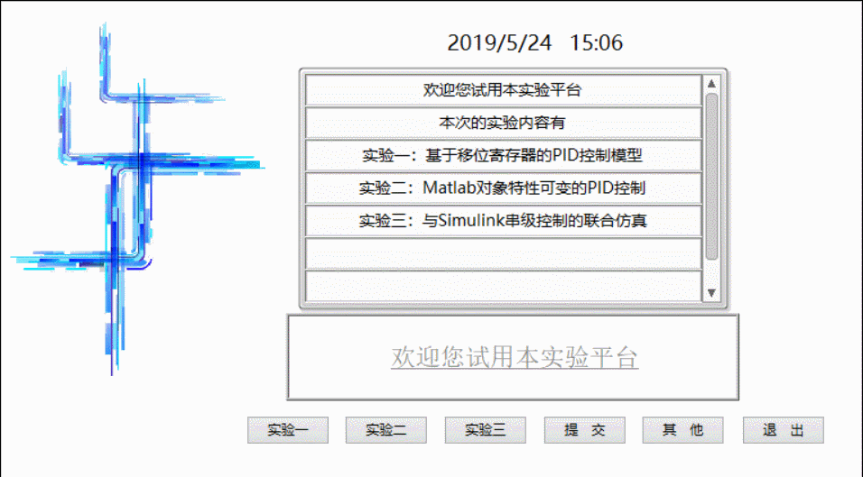
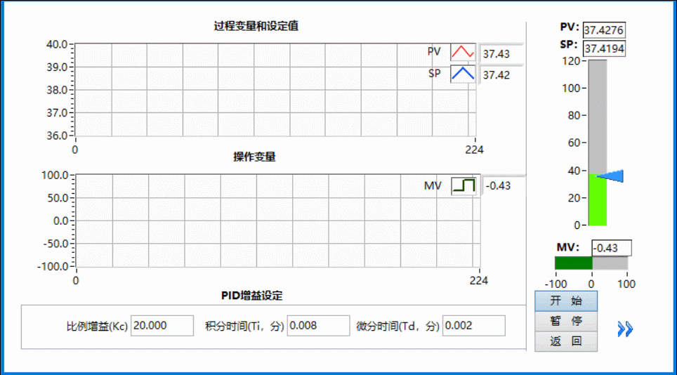
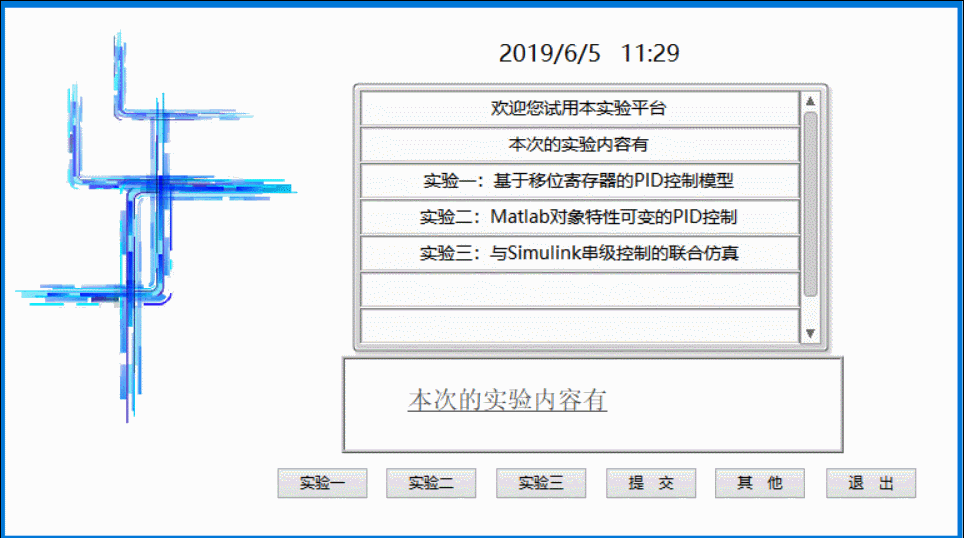
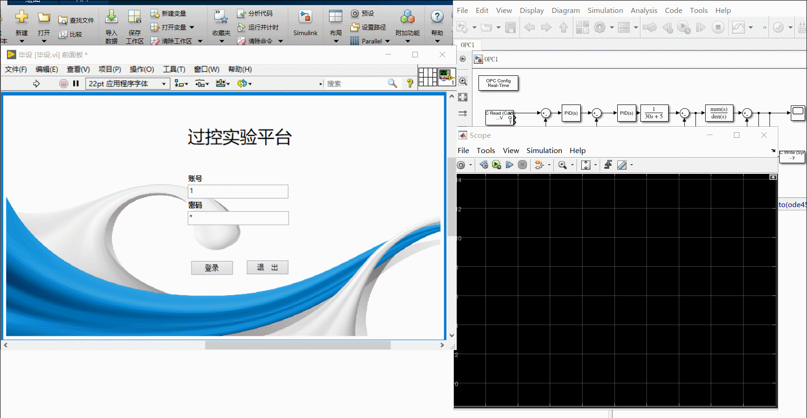
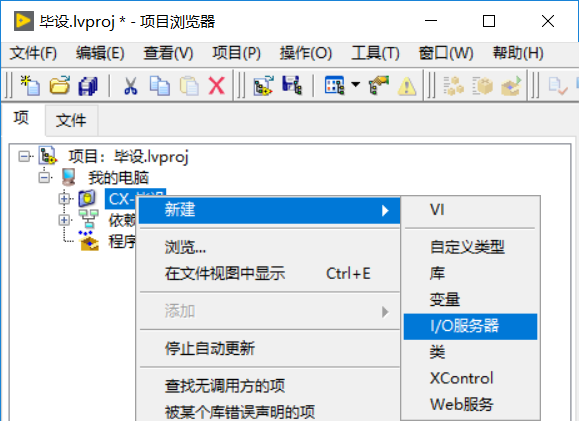
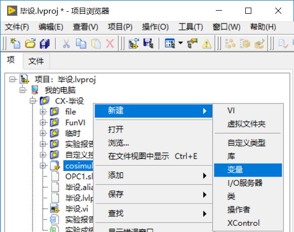
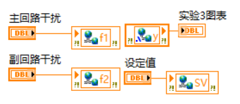
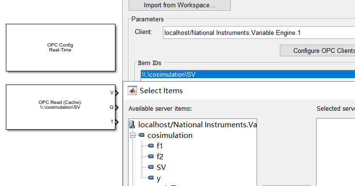

# 　　　　    　 基于LabVIEW的过控实验平台设计
## 概述 
本程序为本科毕设《基于基于LabVIEW的过控实验平台设计》的具体实现，为作者学习LabVIEW近一周之后开始着手设计，设计一周后转向其他学习项目，之后到答辩之前偶尔修修补补，在网友面向晨曦帮助进行了程序的整体结构以及UI优化，从开始到完工横跨两个月。 
可供LabVIEW初学者借鉴的主要内容包括：
* 数据库与LabVIEW的ODBC连接
* 登录注册系统设计（关于修改密码之类的功能会有所提及）
* 公告轮播显示功能的实现
* 不同选项卡之间切换的基本实现
* PID调节实验的三种不同实现方式
    * 直接使用LabVIEW的基础控件实现PID实验
    * 使用Matlab脚本节点实现仿真
    * 通过OPC通讯的方式实现LabVIEW和Simulink的联合仿真
* 自动报表功能的实现
    * 自动生成word实验报告（数据+图像）
    * 自动excel报表
* 网友面向晨曦添加的功能较为丰富的用户管理系统（具体功能读者可自行研究2.0版本，不作展示） 

## *本设计为简易虚拟实验平台的概念化实现，注重主要功能的实现方式，实用性的提升有待具体的进一步开发。主要在实验过程的主要难点上进行实现，具体内容只要掌握方法都是搬砖过程。* 

## ODBC连接
ODBC的连接方式及设置方式以及有无数大佬发过极其详细的帖子了，读者自行百度即可，这里只讲主要思路。 
数据库我最初选择的是MySQL,本人对数据库几乎一无所知，所以这里推荐没有数据库基础的朋友使用Navicat For MySQL这款可视化数据库设计软件，可以省去很多麻烦。终版为使用Access数据库实现的登录系统，读者可参考程序研究实现方法。
 这里放几张过程图： 

	
	

		Navicat与MySQL建立连接
	

	
	

		建立信息表
	

	
	

		进行表设计
	

	
	

		进行表设计
	

	
	

		在命令窗口查看已建立数据库
	

	
	

		建立ODBC数据连接
	

 这里可能会出现一个问题，32位LabVIEW和64位的其他程序不兼容，可以百度搜索应用程序池，将下图的启用32位程序设置成TRUE可以解决很多32位64位不兼容的问题。

	
	

		进行应用程序默认设置
	

<h2>动图效果展示</h2>

	
	

		登录
	

	
	

		公告
	

	
	

		正确结果
	

	
	

		错误结果
	

	
	

		实验报表
	

	
	

		与Simulink联合仿真
	

<h2>注：</h2>
<h4>1.实验二的基于Matlab脚本节点的PID实现未做动态演示，程序部分非常简单，一目了然。</h4>
<h4>2.与Simulink的OPC通讯方法这里列举一下重点，读者可参考项目文件下的OPC1.slx文件及cosimulation.lvlib配置结合下面的主要步骤尝试实现</h4>
<h5>　　（1）安装LabVIEW的DSC模块</h5>
<h5>　　（2）新建IO服务器</h5>

	

	

<h5>　　（3）新建共享变量</h5>

	

<h5>　　（4）在LabVIEW中配置共享变量</h5>

	

<h5>　　（5）在Simulink中配置OPC属性</h5>

	

<h4>3.实验报表系统相对简单，程序中有详细案例。这里为方便读者快速掌握方法提两个关键词：word中通过"书签"，excel中通过"别名"即类似于A1,C3这种属性来对数据插入点进行定位。</h4>
<h1>欢迎搬运，但请注明出处并附链接，谢谢！</h1>
